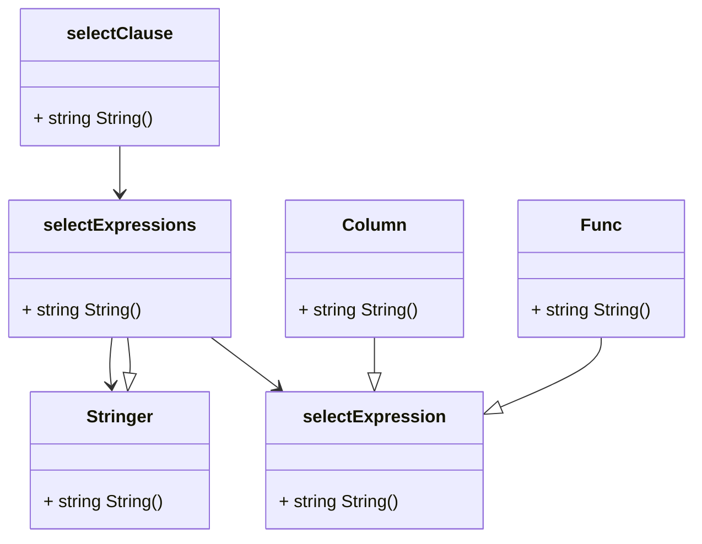

# goquを薄く作るやつ

## tasks

- [x] selectできる
  - [x] `where id = 1`
  - [x] `from users`
  - [x] `limit 1`
  - [x] `select id`
  - [x] `select *`
  - [x] `group by user_id`
  - [x] `count(id)`
  - [x] `join("users", "user_id", "id")`

## Design Docs

### structからstringへの変換戦略案

- 受け渡す型戦略
  - `word`
    - 繋いでいくスタイル
    - 独自の構造体を引き回す必要あり
    - べったり
    - 全体的に文字列化する処理を共通化するため、空白区切りの制御ができない
    - メリットが思いつかない
      - スライスで引き回すよりはマシ
  - `[]string`
    - wordのほうがマシ
    - 独自構造体を使わなくていい気楽さがある
  - `string`
    - 結局これがたぶん正解
    - それぞれの事情に応じて修飾を変えることができるから、これで決まりかも。
    - 今の`worder` interfaceを
- 入れ子戦略
  - 共通のインターフェースを持つ案
    - +1 メソッド名が強制的に共通化させられる。
    - -1 変な入れ子構造を作れる。((select (id)) (from (table_name)))以外の形を型が許容してしまう
    - +1 walkerみたいな、再帰探索を簡単に書ける
      - 再帰探索しないならいらなさそう
    - 型
      - (sql string, params []string, err error)
  - メソッド名だけ共通化する強い気持ちを持つ案
    - +1 メソッド名をゆるく共通化する
    - +1 変な入れ子構造を作れない。
    - -1 強い気持ちを持っていないと、「ここだけ特殊だから...」で分岐が増えて、そのうち地獄を見る

インターフェースを活用する。複数種の子を持つ要素の場合、インターフェースでまとめると親が子の詳細を知らなくて済む。
以下はselect配下を簡単に示しもの.

